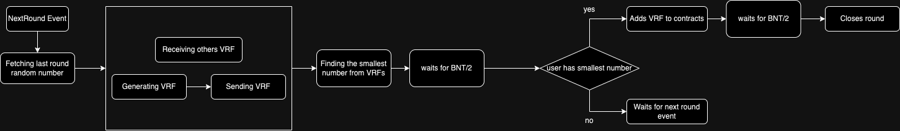

# Banana-VRF

## Diagram



BNT - Block Number Threshold - constant

## Tech
Project is using smart contracts written in Solidity deployed on LUKSO Testnet and offchain websocket message relay servive for sending VRFs and for consensus method.

## Usage

### Client
Run client - required Go 1.21.4

Here is example setup (working with LUKSO Testnet):

```
cd tests
go get .
go run . -rpc wss://rpc.eu-central-1.gateway.fm/ws/v4/lukso/ -chain_id 4201 -contract D061CEb1F6BE5b6822762893e229FFce5C62C283 -priv0 <priv_key>
```

- chain_id - chain id of dest chain
- contract - VRFHost address - D061CEb1F6BE5b6822762893e229FFce5C62C283
- priv0 - private key of EOA (in hex string [without 0x])

Then open browser and type http://localhost:3327/add0 - this will add minimal required stake (it will send some LYXt to VRFHost contract) to participate in randomness generation process.

You need to wait for 3 rounds before you can run banana-vrf-client:

```
cd client
go get .
go build
./banana-vrf-client -port 3031 -rpc wss://rpc.eu-central-1.gateway.fm/ws/v4/lukso/non-archival/testnet -chain_id 4201 -contract D061CEb1F6BE5b6822762893e229FFce5C62C283 -priv <priv_key> -relay 209.38.204.206:3333
```
- port - debug http api
- rpc - rpc address (needs to be using websockets)
- chain_id - chain id of dest chain
- contract - VRFHost address - D061CEb1F6BE5b6822762893e229FFce5C62C283
- priv - private key of EOA (in hex string [without 0x])
- relay - address of websocket message relay (we host 209.38.204.206:3333)

### VRFConsumer - LSP8Random

Generate LSP8 with random tokenId - required Node.JS v16.20.0 & yarn

```
cd contrats
yarn
yarn hardhat compile
yarn premint # this orders contract to prepare mint from random number
yarn token # mints token with random tokenId
```

- after premint you need to wait until round with id printed by ```yarn premint``` command is finalized (you need to wait 2-3 rounds)
- after that you can execute ```yarn token``` - it will mint you a token (LSP-8) with random tokenId and displays it

### Utils

You can track round progress using ```yarn round``` command (inside contract folder)

Running ```go run . -rpc wss://rpc.eu-central-1.gateway.fm/ws/v4/lukso/ -chain_id 4201 -contract D061CEb1F6BE5b6822762893e229FFce5C62C283 -priv0 <priv_key>``` inside /tests folder will run also /round?id=[round_id] route where you can preview state of every round. (for example http://localhost:3327/round?id=1 returns info about first round)